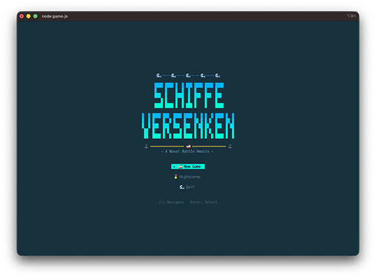
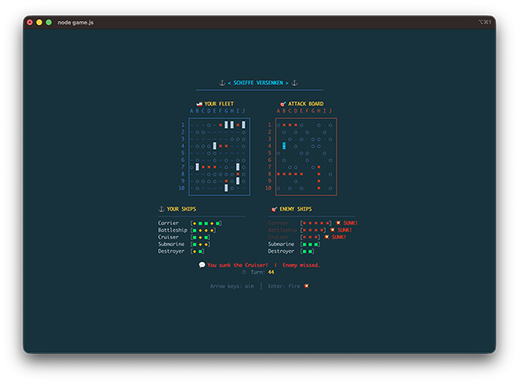
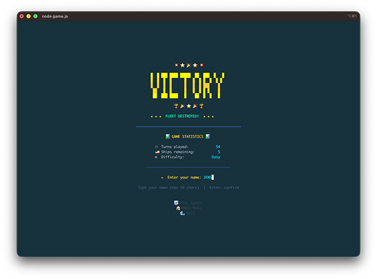
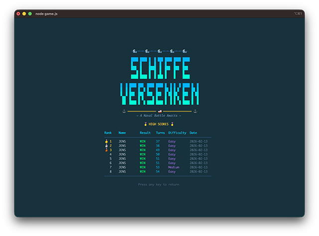

```
  ____   ____ _   _ ___ _____ _____ _____
 / ___| / ___| | | |_ _|  ___|  ___| ____|
 \___ \| |   | |_| || || |_  | |_  |  _|
  ___) | |___|  _  || ||  _| |  _| | |___
 |____/ \____|_| |_|___|_|   |_|   |_____|
          __     _______ ____  ____  _____ _   _ _  _______ _   _
          \ \   / / ____|  _ \/ ___|| ____| \ | | |/ / ____| \ | |
           \ \ / /|  _| | |_) \___ \|  _| |  \| | ' /|  _| |  \| |
            \ V / | |___|  _ < ___) | |___| |\  | . \| |___| |\  |
             \_/  |_____|_| \_\____/|_____|_| \_|_|\_\_____|_| \_|
```

**A retro terminal-based Battleship game. Sink the enemy fleet before they sink yours.**

---






## How to Run

```bash
node game.js
```

Requires **Node.js 18+**. Zero external dependencies.

## How to Play

1. Place your fleet on the grid, one ship at a time.
2. Take turns firing shots at the enemy grid.
3. Hits are marked red, misses are marked blue.
4. Sink all five enemy ships to win. Don't let them sink yours first.

## Controls

| Key | Action |
|-----|--------|
| Arrow keys | Navigate cursor / menu |
| Enter | Confirm / Fire |
| R | Rotate ship (during placement) |
| Escape | Back / Cancel |
| Letters/Numbers | Name entry (game over screen) |
| Backspace | Delete character (name entry) |
| Ctrl+C | Quit |

## Game Phases

| Phase | What Happens |
|-------|-------------|
| **Title** | Main menu -- start a new game, view highscores, or quit |
| **Difficulty** | Pick your opponent: Easy, Medium, or Hard |
| **Placement** | Position your five ships on the 10x10 grid |
| **Battle** | Fire at the enemy grid, survive return fire |
| **Game Over** | See the result, enter your name for the leaderboard |

## Difficulty Levels

| Level | AI Behavior |
|-------|-------------|
| **Easy** | Fires randomly -- pure luck |
| **Medium** | Hunts adjacent cells after scoring a hit |
| **Hard** | Follows ship axis after consecutive hits |

## Ships

| Ship | Size |
|------|------|
| Carrier | 5 |
| Battleship | 4 |
| Cruiser | 3 |
| Submarine | 3 |
| Destroyer | 2 |

## Highscores

Scores are saved to `highscores.json` in the project directory. Viewable from the main menu. Ranked by fewest turns -- efficiency wins.

## Technical

Built with Node.js. Zero external dependencies. Renders entirely through ANSI escape codes in your terminal. No frameworks, no libraries, just raw stdin/stdout.
